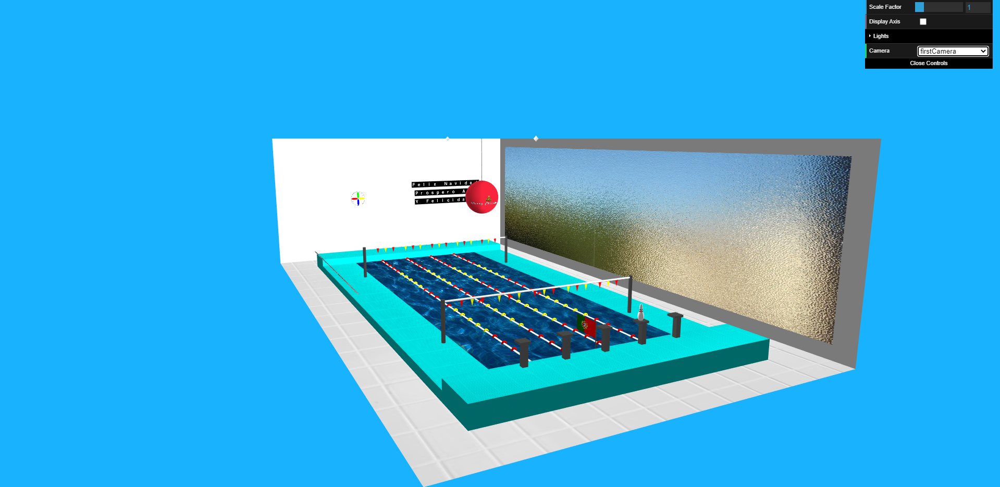

# LAIG 2020/2021

## Group T02G02
| Name               | Number    | E-Mail               |
| ------------------ | --------- | -------------------- |
| Diogo Nunes        | 201808546 | up201808546@fe.up.pt |
| Jéssica Nascimento | 201806723 | up201806723@fe.up.pt |

----

## Projects

### [TP1 - Scene Graph](TP1)

* The scene represents an indoor swimming pool, more specifically the FADEUP swimming pool. 
* Scene: [Relative link](TP1/scenes/demo.xml)
* 
* 

-----

### [TP2 - Scene Graph, Animations, Spritesheets and NURBS Primitives](TP2)
* Added to TP1 scene:
    - Boat, clock and hanging christmas ball **keyframe animations**.
    - Santa **sprite animation** and Christmas song lyrics **spritetext**.
    - NURBS Primitives: Santa's TV screen using **Plane**, olympics texture footer using **Patch** and bowling pin using **Barrel**.
* Scene: [Relative link](TP2/scenes/LAIG_TP2_T2_G02.xml)
* 
* 

----

### [TP3 - 3D Game Interface](TP3)
* Prolog game: Green Skull
- Scene: [Relative link](TP3/scenes/wood.xml) to the default scene theme: 2 more themes available.
  - Simple room with a wood table.
  - Game structure all on top of the table.

  
  

